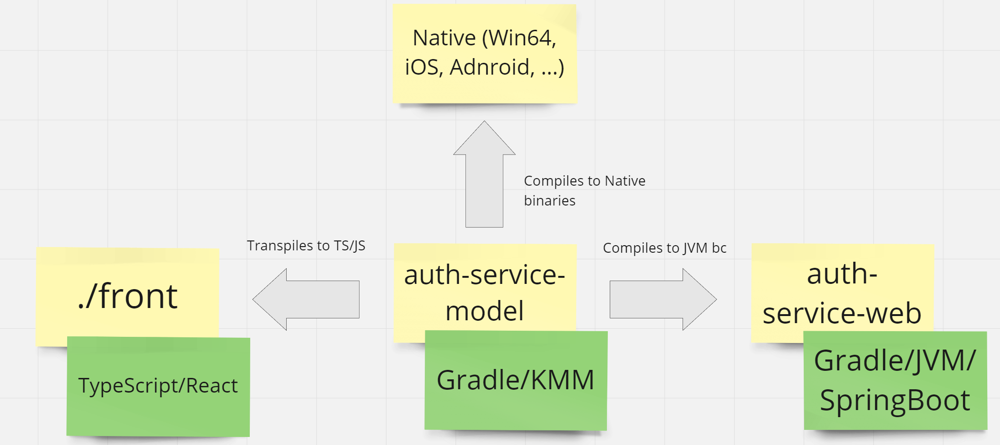

# Example service with SpringBoot MVC and React/RTK

## Back
1. Install Java 17+ and Gradle 8.0+
2. Run  ```./gradlew clean :auth-service-model:jsNodeProductionLibraryDistribution :auth-service-web:bootRun```

## Front
1. Install NPM 18+
2. Run  ```npm start --prefix front```

## Use case
1. Open [http://localhost:8080](http://localhost:8080)
2. If you see ```You are not authorized``` click ```Login```
3. Type ```y``` in the console of the backend application
4. You will see ```You are Harry Potter```
5. Done


## KMM
- [Add Kotlin/JS support to your KMM library](https://dev.to/touchlab/add-kotlinjs-support-to-your-kmm-library-48d9)


